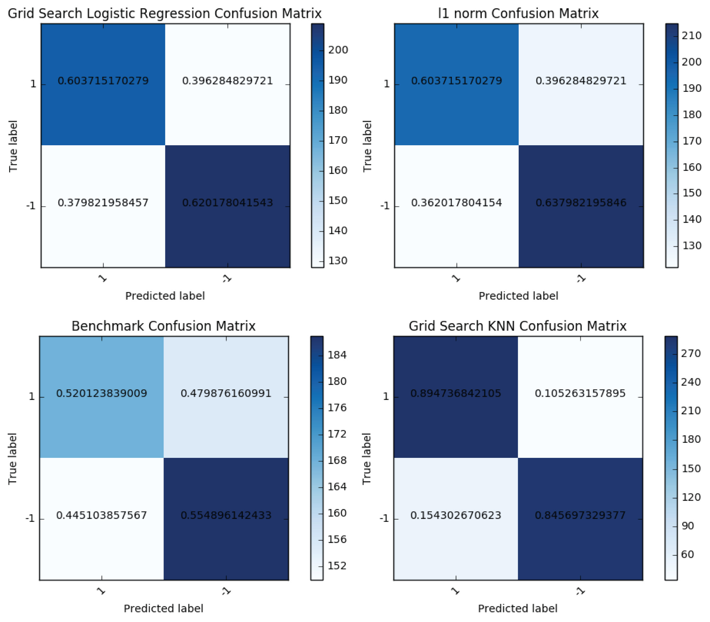

# Predicting UCI's Madelon Data Set using Logistic Regression and KNN

Scott Tarlow

see Report.pdf for better formatting. see iPython notebooks for raw code for each pipeline.

## Introduction

### Domain and Data
This project will be working with UCI's Madelon data set. The data is completely artificial, randomly labeled +1 or -1 with 500 features. Of these 500 features, 20 of them are "real" features and the remaining 480 are "probes" which add noise to the data. Of the 20 real features, there are 5 informative features, and the remaining 15 are linear combinations of the 5 informative features to add additional noise. The order of the features and patters were randomized.

### Problem Statement
Predicting a synthetic data set such as UCI's Madelon can be difficult because the features are anonymous. The goal of this project is to use statistical models to perform both feature selection and classification. There will be no exploratory data analysis.

### Solution Statement
To predict the labels (1 or -1) of this data set, four models will be built. First, a naive logistic regression (no regularization penalty) will be made as a benchmark for our classification score. Second, a logistic regression model with a l1 norm penalty to regularization for the data set's features. Third, a logistic regression model whose parameters are tuned through grid search and cross-validation. Finally, a K nearest neighbors classifier with parameters tuned through grid search and cross-validation will be used in case the data set is non-linear.

### Metric
I will use the standard classification metric, "accuracy".  IE, what percentage did the model label the data points correctly. I will Also look at false positives, and AUC as some deeper metrics to further provide some context as I make more complex models. In addition, KNN's accuracy will be calculated through the standard Minkowski Metric. However, the results of the KNN will be comparable to the logistic regression through AUC and confusion matrix analysis.

### Benchmark
A naive logistic regression (no regularization penalty) will be made as a benchmark for our classification score.

## Methods

### Building the Benchmark/ Logistic Regression Model
{ width=500px }

The schematic above shows the methodology for building the benchmark logistic regression model. First I load the data from the data base into a Pandas DataFrame. I then separate the features from the labels (target vector). I then Make a data dictionary, which stores a train-test split of the provided data. This train-test split is important because that means I can train my logistic regression model with the split off training set and then validate my model with the unseen test data set. I then scale the features in both the training and test data set. Finally, I train my logistic regression model on the training set, and predict the labels of the data set on the test set. The benchmark runs a "C" value of 10000 whereas the "C" value of the second logistic regression model is 0.01 using the l1 norm as a penalty.

### Feature Selection using Logistic Regression and SelectKBest
{ width=500px }

The schematic (above) for using logistic regression to select important features is the same as building the second (l1 norm) logistic regression model. Instead of predicting on the test set, a table of coefficients for each feature is obtained, with larger coefficients being more meaningful than smaller coefficients. 

To use SelectKBest to find relevant features, use the schematic above except instead of "general model" add another "general transformer" which puts SelectKBest after the standard scaler. This method takes the 10 (in this project, but can be changed to any integer) highest scoring features in ANOVA F-value and transforms your feature matrix accordingly. Also, it provides the ANOVA F-value score for every feature, even though only 10 are returned in the feature matrix.

### Gridsearch tuned Logistic Regression and KNN
{ width=500px }

The schematic (above) for building models tuned by grid search is the same as the SelectKBest schematic except you take the feature matrix from SelectKBest and place that into GridSearchCV. GridSearchCV allows me to tune my model's parameters, for logistic regression I loop through penalties 0.005 to 0.1, and change the regularization feature from l1 and l2 norms. For KNN, the grid search parameters are how many neighbors are used to classify the label (1 to 100) and if the neighbors are weighted uniformly or by distance.

## Results

### Feature Selection from l1 norm regularization and SelectKBest

$$\begin{array}{c|c|c|} 
 & \text{Selected Features (in order of score, nonzero)} \\ \hline
\text{l1 Norm} & 241 \\ \hline
\text{SelectKBest} & 241,475,048,378,336,064,442,472,128,338\\ \hline
\end{array}$$

The table above shows all the nonzero selected features from l1 norm regularization and SelectKBest

The l1 norm regularization reduced all coefficients of all the features to zero except for feature 241. This is in agreeance with the SelectKBest, as feature 241 was also the its highest scoring feature. However, SelectKBest's other 9 features scored high, conflicting with the l1 norm's reduction to only 1 feature. This is an important factor when looking at the results of Logistic Regression vs KNN.

### Logistic Regression and KNN classification

#### Scoring and Area under ROC curve

$$\begin{array}{c|c|c|c|c|} 
 & \text{Best Paramters} & \text{Training Score} & \text{Test Score} & \text{AUC} \\ \hline
\text{Benchmark Logistic Regression} & penalty = l2, C=10000 & 0.807 & 0.538 & 0.538 \\ \hline
\text{Logistic Regression} & penalty = l1, C = 0.01 & 0.610 & 0.621 & 0.621\\ \hline
\text{GridSearch Logistic Regression} & penalty = l1, C=0.020 & 0.613 & 0.611 & 0.610\\ \hline
\text{GridSearch KNN} &  n-neighbors = 6, weights = distance & 1.0 & 0.870 & 0.870\\ \hline
\end{array}$$

The table above shows the models run, best parameters for the models run (if grid searched), their training score, test score and area under the ROC curve. The benchmark model had a very high training score relative to its test score indicating that the model is over fit, despite the test score being not much better than a coin flip. Adding l1 regularization lowered Logistic Regression's training score significantly, however its test score rose to 0.621! When grid searching over both penalty and C, the strength of regularization, Logistic Regression did not fare much better than when C = 0.01. This indicates that the features in the Madelon data set are very nonlinear, and that there might be some limits to logistic regression on this data set.

When using SelectKBest to select the 10 best features and then grid searching over weights and how many neighbors to make the classification, KNN had a training score of 1.0 (perfect) and a test score of 0.870. While the perfect training score might indicate that this model is over fit, there is a almost equally high test score. KNN can achieve better results than Logistic Regression probably because of how non-linear the data set is. We can even see this in the confusion matrices for the models below 

{ width=500px }

The color bar represents the true number of samples in each part of the confusion matrix whereas the normalized True Positive, True Negative, False Positive, and False negative rates are shown in the middle of each square. Easily seen is that KNN has by far the highest True Positive and True Negative Rate.

## Conclusion

Given the results, Logistic Regression has difficulty predicting labels in this data set with the given features. SelectKbest, when selecting the 10 features, does a good job finding the most important features. Furthermore, KNN did a very good job at predicting the labels, with a 0.895 True Positive rate and a 0.846 True Negative rate. 

However, given the data set description, where there are 5 "informative" features and the rest are either linear combinations of those features or complete noise, a better job of feature selection could be done in the future. The problem with SelectKBest is that you are guessing "k" for the right number of features and hoping that your model takes care of the rest through regularization. A more sophisticated approach, like Recursive Feature Elimination may be able to minimize features while keeping a high prediction score. Since Recursive Feature Elimination allows the modeler to use a sophisticated estimator to select the best features, and order them in level of importance, using a strong non-linear estimator such as a Random Forest Classifier would be a good place to start.

Other models to consider other than KNN might be to just use a Random Forest Classifier to make the classifications (instead of KNN) or a gradient boosted decision tree.
